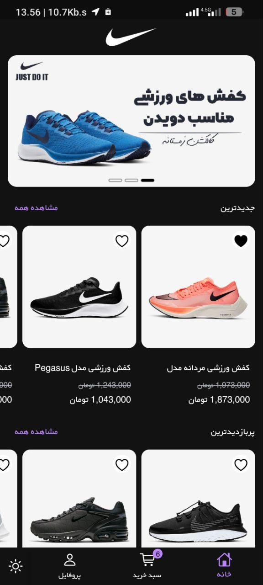
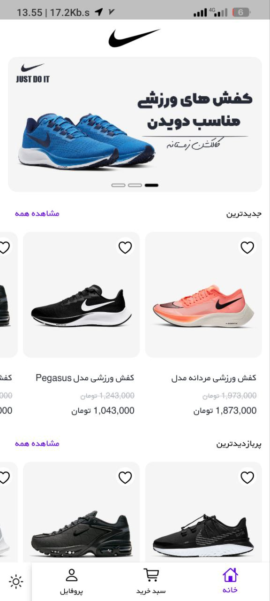

<div align="center">


<br/>


</div>

---

## 📱 App Overview

**Nike Store** is a beautifully crafted e-commerce Flutter application inspired by the Nike brand. It focuses on delivering a premium shopping experience with smooth animations, stunning UI components, and a clean product browsing flow.

🔗 [**View on GitHub**](https://github.com/AchkanDev/Nike_store)

---

## 🖼️ Screenshots

<div align="center">

| Home | Product Listing | Product Detail | Cart |
|------|----------------|----------------|------|
|  |  |  |  |

</div>

---

## ✨ Key Features

- 🛍️ **Product Catalog** — Browse shoes with category filters
- 🔍 **Product Search** — Find products instantly
- 🖼️ **Product Detail** — Full-screen view with size & color selector
- 🛒 **Shopping Cart** — Add, remove, and manage items
- ❤️ **Wishlist** — Save favorites for later
- ✨ **Smooth Animations** — Hero transitions & page animations
- 🎨 **Premium Design** — Dark/light theme with Nike aesthetics

---

## 🏗️ Architecture & Tech Stack

```
lib/
├── models/            # Product, Cart, User models
├── screens/           # Home, Detail, Cart, Profile
├── widgets/           # Reusable UI components  
├── providers/         # State management
└── utils/             # Constants, theme, helpers
```

| Layer | Technology |
|-------|-----------|
| **UI** | Flutter + Custom Nike Design |
| **State** | Provider / Riverpod |
| **Navigation** | Flutter Navigator 2.0 |
| **Data** | Local JSON / Mock API |

---

## 🎨 Design Highlights

- ⚫ **Dark Mode First** — Sleek dark theme with white accents
- 🏃 **Hero Animations** — Seamless product transitions
- 📐 **Custom Components** — Nike-style buttons, cards, bottom nav
- 📱 **Responsive Layout** — Works on all screen sizes

---

<div align="center">

[](https://github.com/AchkanDev/Nike_store)
[](https://github.com/AchkanDev)


</div>
